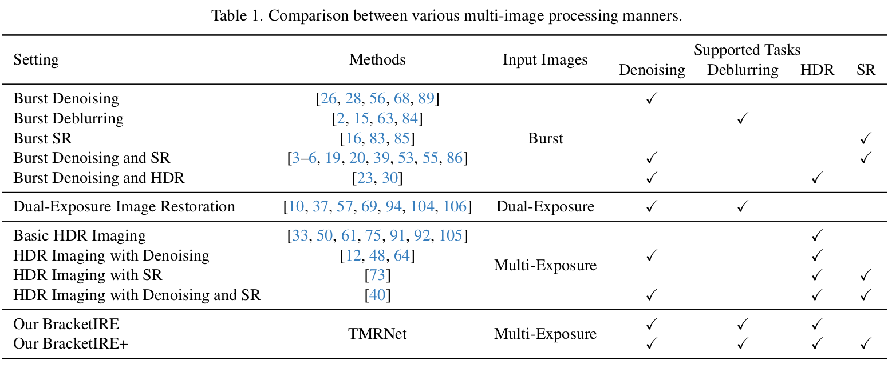
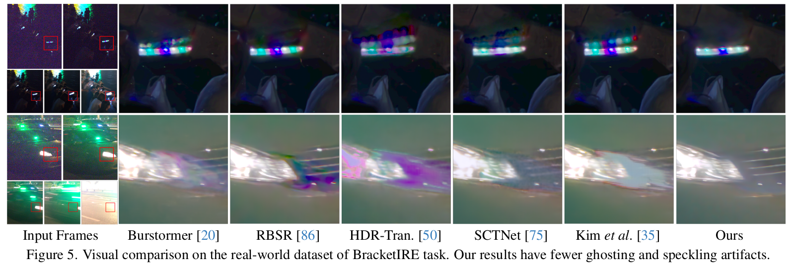
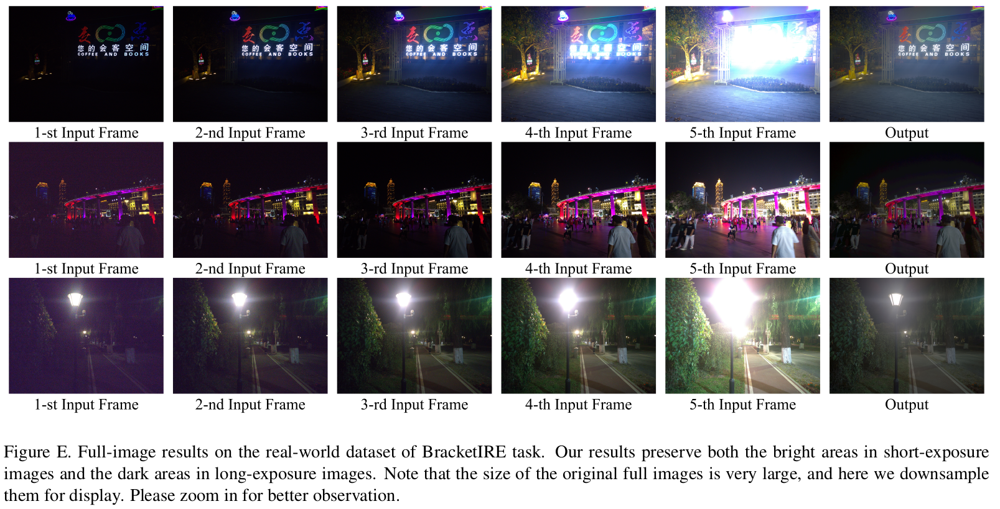

# BracketIRE

PyTorch implementation of [**Bracketing is All You Need: Unifying Image Restoration and Enhancement Tasks with Multi-Exposure Images**](https://arxiv.org/abs/2401.00766) 

- In this work, we propose to utilize bracketing photography to unify image restoration and enhancement tasks, including image denoising, deblurring, high dynamic range reconstruction, and super-resolution.

- Codes will be released in a few weeks.

## 1. Abstract

It is challenging but highly desired to acquire high-quality photos with clear content in low-light environments. Although multi-image processing methods (using burst, dual-exposure, or multi-exposure images) have made significant progress in addressing this issue, they typically focus exclusively on specific restoration or enhancement tasks, being insufficient in exploiting multi-image. Motivated by that multi-exposure images are complementary in denoising, deblurring, high dynamic range imaging, and super-resolution, we propose to utilize bracketing photography to unify restoration and enhancement tasks in this work. Due to the difficulty in collecting real-world pairs, we suggest a solution that first pre-trains the model with synthetic paired data and then adapts it to real-world unlabeled images. In particular, a temporally modulated recurrent network (TMRNet) and self-supervised adaptation method are proposed. Moreover, we construct a data simulation pipeline to synthesize pairs and collect real-world images from 200 nighttime scenarios. Experiments on both datasets show that our method performs favorably against the state-of-the-art multi-image processing ones.

## 2. Comparison of Multi-Image Processing Manners

    

## 3. Real-World Results

