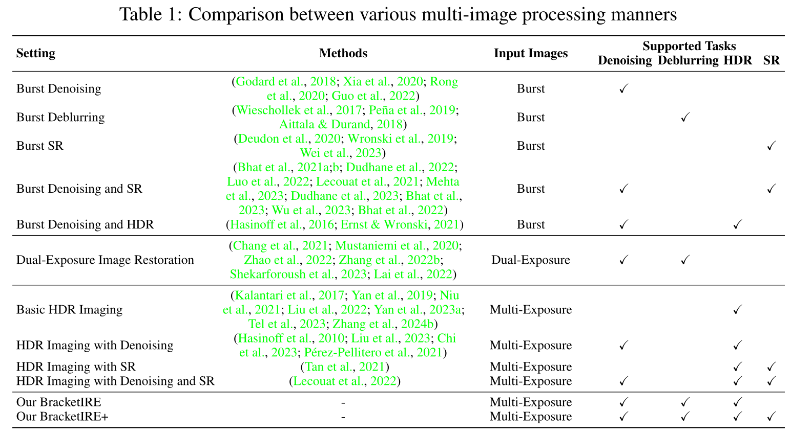

# Exposure Bracketing Is All You Need (ICLR 2025)

Official PyTorch implementation of **Exposure Bracketing Is All You Need**

In this work, we propose to utilize bracketing photography to get a high-quality image by combining image denoising, deblurring, high dynamic range reconstruction, and super-resolution tasks. The paper is as follows:

> [**Exposure Bracketing Is All You Need For A High-Quality Image**](https://arxiv.org/abs/2401.00766) 
> [Zhilu Zhang](https://scholar.google.com/citations?user=8pIq2N0AAAAJ), [Shuohao Zhang](https://scholar.google.com/citations?hl=zh-CN&user=PwP5O3MAAAAJ), [Renlong Wu](https://scholar.google.com/citations?hl=zh-CN&user=UpOaYLoAAAAJ), [Zifei Yan](https://scholar.google.com/citations?hl=zh-CN&user=I4vuL7kAAAAJ), [Wangmeng Zuo](https://scholar.google.com/citations?user=rUOpCEYAAAAJ)
 Harbin Institute of Technology, China  
> [**OpenReview**](https://openreview.net/forum?id=rDIf6NA5mj) &nbsp; | &nbsp;  [**arXiv**](https://arxiv.org/abs/2401.00766)

We organized a [Bracketing Image Restoration and Enhancement Challenge](https://github.com/cszhilu1998/BracketIRE/tree/master/NTIRE2024)  on [NTIRE Workshop](https://cvlai.net/ntire/2024/) of CVPR 2024. The challenge report is as follows:

> [**NTIRE 2024 Challenge on Bracketing Image Restoration and Enhancement: Datasets Methods and Results**](https://openaccess.thecvf.com/content/CVPR2024W/NTIRE/html/Zhang_NTIRE_2024_Challenge_on_Bracketing_Image_Restoration_and_Enhancement__CVPRW_2024_paper.html) 
> [Zhilu Zhang](https://scholar.google.com/citations?user=8pIq2N0AAAAJ)$^1$, [Shuohao Zhang](https://scholar.google.com/citations?hl=zh-CN&user=PwP5O3MAAAAJ)$^1$, [Renlong Wu](https://scholar.google.com/citations?hl=zh-CN&user=UpOaYLoAAAAJ)$^1$, [Wangmeng Zuo](https://scholar.google.com/citations?user=rUOpCEYAAAAJ)$^1$, [Radu Timofte](https://scholar.google.com/citations?user=u3MwH5kAAAAJ&hl=zh-CN&oi=ao)$^2$, et al.
 $^1$ Harbin Institute of Technology, China
 $^2$ University of Würzburg, Germany  
> [**Challenge Report**](https://openaccess.thecvf.com/content/CVPR2024W/NTIRE/html/Zhang_NTIRE_2024_Challenge_on_Bracketing_Image_Restoration_and_Enhancement__CVPRW_2024_paper.html) &nbsp; | &nbsp;  [**Slides**](https://drive.google.com/file/d/1pD549TKzNjII6CpnwB05UZ4V-U4OK5Kg/view?usp=drive_link) &nbsp; | &nbsp; 
[**Video**](https://drive.google.com/file/d/1moSKjFXR8FqJ_Oh11z94wABwemF4LrIh/view?usp=drive_link) &nbsp; | &nbsp; 
[**Poster**](https://drive.google.com/file/d/1iqKMpEvUfjlFCY_MZcDKDJoHkxrGDHe8/view?usp=drive_link) 

<!-- - Codes will be released in a few weeks. -->

## News

* **`2025-01-24`:** The code for generating synthetic dataset have been released in [syn_data_gen](./syn_data_gen/) folder.

* **`2025-01-22`:** The paper has been accepted by ICLR 2025.

* **`2024-06-02`:** The training, inference and evaluation codes for real-world dataset have been released.

* **`2024-05-01`:** The training, inference and evaluation codes for synthetic dataset have been released.

* **`2024-03-26`:** The synthetic dataset has been released.

* **`2024-02-05`:** The codes, pre-trained models, and ISP for the Bracketing Image Restoration and Enhancement Challenge are released in [NTIRE2024](./NTIRE2024/) folder. (The codes have been restructured. If there are any problems with the codes, please contact us.)

* **`2024-02-04`:** We organize the Bracketing Image Restoration and Enhancement Challenge in [NTIRE 2024](https://cvlai.net/ntire/2024/) (CVPR Workshop), including [Track 1 (BracketIRE Task)](https://codalab.lisn.upsaclay.fr/competitions/17573) and [Track 2 (BracketIRE+ Task)](https://codalab.lisn.upsaclay.fr/competitions/17574). Details can bee seen in [NTIRE2024/README.md](./NTIRE2024/README.md). Welcome to participate!

## 1. Abstract

It is highly desired but challenging to acquire high-quality photos with clear content in low-light environments. Although multi-image processing methods (using burst, dual-exposure, or multi-exposure images) have made significant progress in addressing this issue, they typically focus on specific restoration or enhancement problems, and do not fully explore the potential of utilizing multiple images. Motivated by the fact that multi-exposure images are complementary in denoising, deblurring, high dynamic range imaging, and super-resolution, we propose to utilize exposure bracketing photography to get a high-quality image by combining these tasks in this work. Due to the difficulty in collecting real-world pairs, we suggest a solution that first pre-trains the model with synthetic paired data and then adapts it to real-world unlabeled images. In particular, a temporally modulated recurrent network (TMRNet) and self-supervised adaptation method are proposed. Moreover, we construct a data simulation pipeline to synthesize pairs and collect real-world images from 200 nighttime scenarios. Experiments on both datasets show that our method performs favorably against the state-of-the-art multi-image processing ones.

## 2. Prerequisites and Datasets

### 2.1 Prerequisites
- Python 3.9 and **PyTorch 1.12**.
- opencv, numpy, Pillow, timm, tqdm, scikit-image and tensorboardX.
- We provide detailed dependencies in [`requirements.txt`](requirements.txt)

### 2.2 Synthetic Dataset

Please download the data from Baidu Netdisk (Chinese: 百度网盘).

- BracketIRE task: https://pan.baidu.com/s/1Jy8G36Njg68UbzsbOEKdZQ?pwd=v4nn
- BracketIRE+ task: https://pan.baidu.com/s/1AKHppSl8ejKR8a8-tnVigA?pwd=kvsd

- We also release the code for generating synthetic dataset in [syn_data_gen](./syn_data_gen/) folder. If you want to customize the synthetic data, you can modify `read_path`,  `write_root`, and ISP parameters in [gen_bracket.py](./syn_data_gen/gen_bracket.py) and [gen_bracketplus.py](./syn_data_gen/gen_bracketplus.py) for BracketIRE and BracketIRE+ tasks, respectively.

### 2.3 Real-World Dataset

- Real-World dataset: https://pan.baidu.com/s/1PYCsRsKEs-tJcIYz_5Mbvg?pwd=7tmf

### 2.4 Pre-Trained Models

- Link: https://pan.baidu.com/s/10bQxDHaZ0sKB87tRooIewg?pwd=wtdg
- Place `spynet`, `syn`, `syn_plus`, `real` and `real_plus` folders in [`ckpt`](ckpt) folder.

**Note: If you cannot get a Baidu account, please use [TeraBox](https://terabox.com) and click [https://terabox.com/s/1nZzGx4Anlp0syXcRhd6xqw](https://terabox.com/s/1nZzGx4Anlp0syXcRhd6xqw) to download.**

## 3. Quick Start for Synthetic Experiments

### 3.1 Training

- BracketIRE task
    - Modify `dataroot`
    - Run [`sh ./syn_bash/train_syn.sh`](./syn_bash/train_syn.sh)

- BracketIRE+ task
    - Modify `dataroot` and  `load_path` 
    - Run [`sh ./syn_bash/train_synplus.sh`](./syn_bash/train_synplus.sh)

### 3.2 Testing

- BracketIRE task
    - Modify `dataroot` and `name`
    - Run [`sh ./syn_bash/test_syn.sh`](./syn_bash/test_syn.sh)

- BracketIRE+ task
    - Modify `dataroot` and `name` 
    - Run [`sh ./syn_bash/test_synplus.sh`](./syn_bash/test_synplus.sh)

## 4. Quick Start for Real-World Experiments

### 4.1 Training

- BracketIRE task
    - Modify `dataroot`
    - Run [`sh ./real_bash/train_real.sh`](./real_bash/train_real.sh)

- BracketIRE+ task
    - Modify `dataroot` 
    - Run [`sh ./real_bash/train_realplus.sh`](./real_bash/train_realplus.sh)

### 4.2 Testing

- BracketIRE task
    - Modify `dataroot` and `name`
    - Run [`sh ./real_bash/test_real.sh`](./real_bash/test_real.sh)

- BracketIRE+ task
    - Modify `dataroot` and `name` 
    - Run [`sh ./real_bash/test_realplus.sh`](./real_bash/test_realplus.sh)

## 5. Note

### 5.1 Evaluation Method

- Note that the evaluation method is different from that of 'Bracketing Image Restoration and Enhancement Challenges on NTIRE 2024'.
- Here, we exclude invalid pixels around the image for evaluation, which is more reasonable. 
- Related explanations can be found in **Appendix B** in our [revised paper](https://arxiv.org/pdf/2401.00766v3.pdf).
- We recommend that you use the new evaluation method in your future work.

### 5.2 Parameter Options

- You can specify which GPU to use by `--gpu_ids`, e.g., `--gpu_ids 0,1`, `--gpu_ids 3`, `--gpu_ids -1` (for CPU mode). In the default setting, all GPUs are used. 
- You can refer to [options](./options/base_options.py) for more arguments.

## 6. Comparison of Multi-Image Processing Manners

## 7. Real-World Full-Image Results

- BracketIRE task

- BracketIRE+ task

<!-- 
## 7. Real-World Results

 -->

## 8. Citation
If you find it useful in your research, please consider citing:

    @inproceedings{BracketIRE,
        title={Exposure Bracketing Is All You Need For A High-Quality Image},
        author={Zhang, Zhilu and Zhang, Shuohao and Wu, Renlong and Yan, Zifei and Zuo, Wangmeng},
        booktitle={ICLR},
        year={2025}
    }

    @inproceedings{ntire2024bracketing,
        title={{NTIRE} 2024 Challenge on Bracketing Image Restoration and Enhancement: Datasets, Methods and Results},
        author={Zhang, Zhilu and Zhang, Shuohao and Wu, Renlong and Zuo, Wangmeng and Timofte, Radu and others},
        booktitle={CVPR Workshops},
        year={2024}
    }

This work is also a continuation of our previous works, i.e., [SelfIR](https://github.com/cszhilu1998/SelfIR) (NeurIPS 2022) and [SelfHDR](https://github.com/cszhilu1998/SelfHDR) (ICLR 2024). If you are interested in them, please consider citing:

    @article{SelfIR,
        title={Self-supervised Image Restoration with Blurry and Noisy Pairs},
        author={Zhang, Zhilu and Xu, Rongjian and Liu, Ming and Yan, Zifei and Zuo, Wangmeng},
        journal={NeurIPS},
        year={2022}
    }

    @inproceedings{SelfHDR,
        title={Self-Supervised High Dynamic Range Imaging with Multi-Exposure Images in Dynamic Scenes},
        author={Zhang, Zhilu and Wang, Haoyu and Liu, Shuai and Wang, Xiaotao and Lei, Lei and Zuo, Wangmeng},
        booktitle={ICLR},
        year={2024}
    }

 

